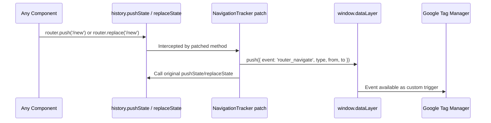

# Add `router_navigate` dataLayer Event for Navigation Tracking

## Problem

Next.js App Router `router.replace()` does not trigger a new `page_view` in GA4 because it calls `history.replaceState` (no new history entry). GTM's built-in History Change trigger also misses some of these. A custom dataLayer event for all client-side navigations solves this.

## Approach: Patch `history.pushState` / `history.replaceState`

Next.js App Router ultimately delegates to the History API. By patching both methods once at the app root, we capture **every** client-side navigation (from `router.push`, `router.replace`, and `<Link>`) with zero changes to existing call sites.

Alternatives considered and rejected:
- **Wrapping `useRouter`** -- would require touching every file that calls `router.push`/`.replace` (~15 files)
- **Extending `useRouteChange`** ([`src/features/route/use-route-change.ts`](src/features/route/use-route-change.ts)) -- reactive only (fires after URL changes); cannot distinguish push from replace

## Changeset (1 new file, 2 edits)

### 1. New file: [`src/features/analytics/navigation-tracker.tsx`](src/features/analytics/navigation-tracker.tsx)

A `'use client'` component that renders `null`. On mount, it wraps `history.pushState` and `history.replaceState` to push a dataLayer event **before** the original call executes (so `from` is the current path at call time):

```typescript
// dataLayer push shape:
{
  event: 'router_navigate',
  type: 'push' | 'replace',   // which History API method was called
  from: '/previous/path',      // window.location.pathname before navigation
  to: '/new/path'              // pathname extracted from the url argument
}
```

Key details:
- Uses a `useRef` guard to ensure patching only happens once (StrictMode safe)
- Reuses the same `getDataLayer()` guard pattern from [`use-analytics-ga4-event.ts`](src/features/analytics/use-analytics-ga4-event.ts) (lines 45-54) for safe `window.dataLayer` access
- Skips the event when `from === to` (same-path navigations, e.g. search param-only changes handled by other means)
- Cleanup in the `useEffect` return restores original methods

### 2. Edit: [`src/features/analytics/index.ts`](src/features/analytics/index.ts)

Add one export line:

```typescript
export * from './navigation-tracker'
```

### 3. Edit: [`src/app/layout.tsx`](src/app/layout.tsx)

Mount `NavigationTracker` alongside existing analytics components, gated behind the same GTM flag (dataLayer events are only useful when GTM is active):

```typescript
import { NavigationTracker } from '../features/analytics'

// In the JSX, after line 77:
{enableGtm && gtmId && <GoogleTagManager gtmId={gtmId} />}
{enableGtm && <NavigationTracker />}
```

## Data flow



## What is NOT changed

- No feature flag env var added (reuses existing `enableGtm` gate in layout)
- No changes to any existing `router.push` / `router.replace` call sites
- No changes to `useRouteChange`, `ScriptsGoogleAnalytics`, or any other existing file
- No translation file needed (no user-facing strings)
