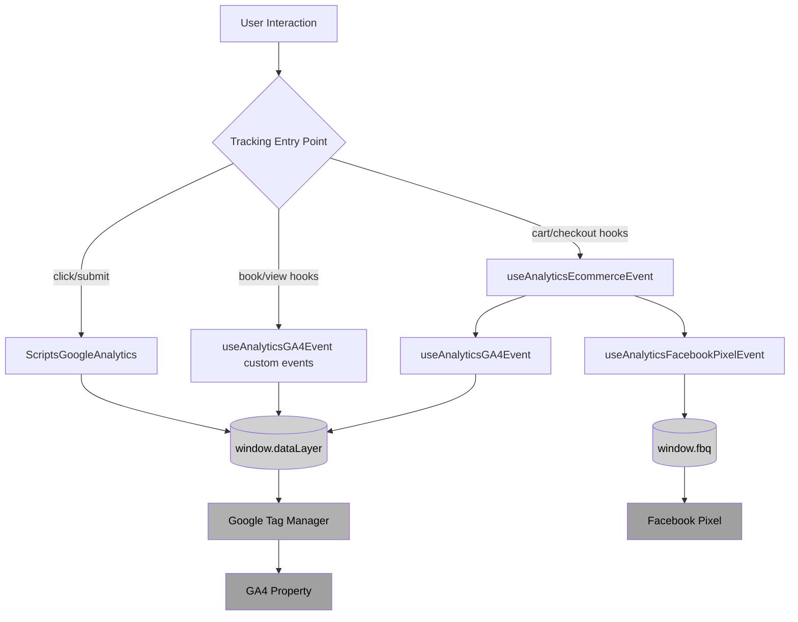
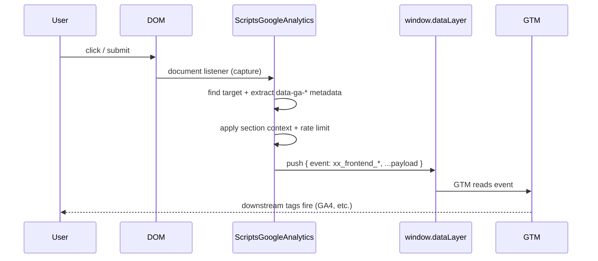

# Analytics Feature Flow Diagrams

> **Client-facing overview:** See [Analytics — User Journey](./client/readme.md) for a digestible, non-technical summary.

## Analytics Architecture Overview

[View diagram source](./diagrams/analytics-architecture-overview.mmd)



## E-commerce Event Routing

[View diagram source](./diagrams/ecommerce-event-routing.mmd)

```mermaid
flowchart LR
    Start([trackEvent(type, data)]) --> Type{Event Type}

    Type -->|add_to_cart| AddCart[Send to FB + GA4]
    Type -->|remove_from_cart| RemoveCart[Send to GA4 only]
    Type -->|begin_checkout| BeginCheckout[Send to FB + GA4]
    Type -->|add_payment_info| AddPayment[Send to FB + GA4]
    Type -->|purchase| Purchase{Has transactionId?}

    Purchase -->|Yes| PurchaseBoth[Send to FB + GA4]
    Purchase -->|No| WarnOnly[Log warning, skip provider calls]

    AddCart --> End([Done])
    RemoveCart --> End
    BeginCheckout --> End
    AddPayment --> End
    PurchaseBoth --> End
    WarnOnly --> End

    style Type fill:#d0d0d0,color:#000
    style Purchase fill:#d0d0d0,color:#000
    style WarnOnly fill:#a0a0a0,color:#000
```

## Global Interaction Tracking Flow

[View diagram source](./diagrams/global-interaction-tracking-flow.mmd)


