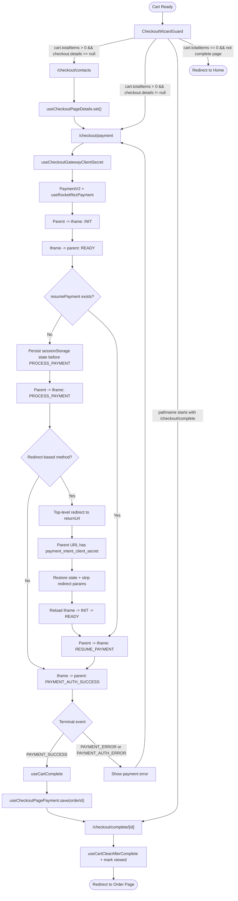
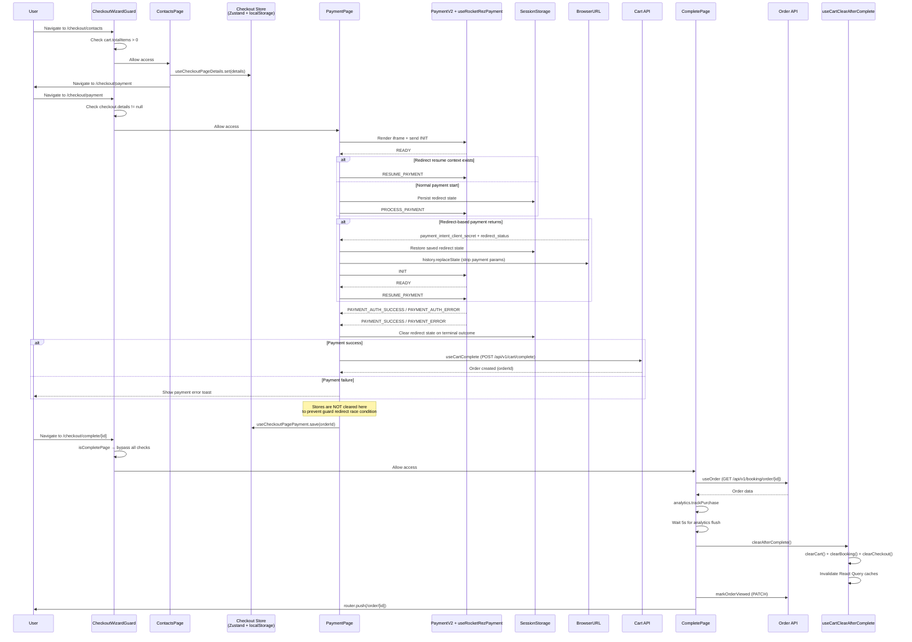
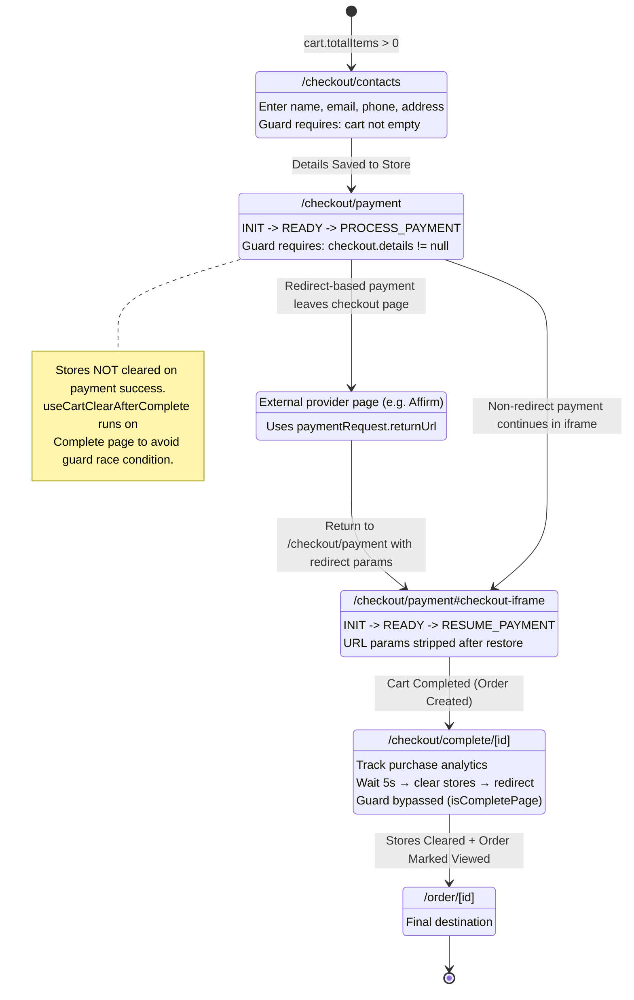
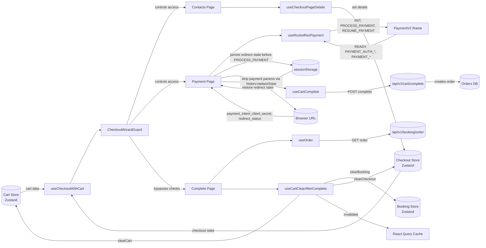

# Checkout Feature Flow Diagrams

> **Client-facing overview:** See [Checkout — User Journey](./client/readme.md) for a digestible, non-technical summary.

Checkout payment supports redirect-based methods (for example, Affirm) through a return URL and resume protocol between the parent page and iframe.

## Checkout Process Flow

[View diagram source](./diagrams/checkout-process-flow.mmd)

## Checkout State Management

[View diagram source](./diagrams/checkout-state-management.mmd)

## Checkout Page Flow

[View diagram source](./diagrams/checkout-page-flow.mmd)

## Data Flow

[View diagram source](./diagrams/data-flow.mmd)

