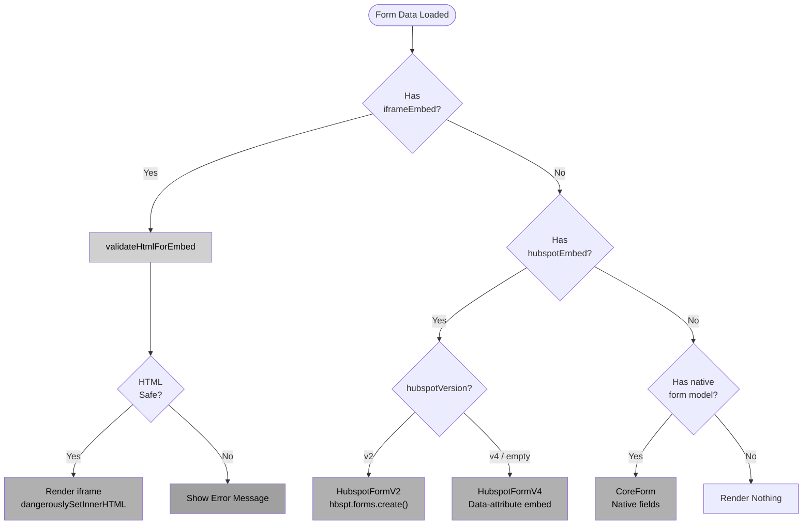
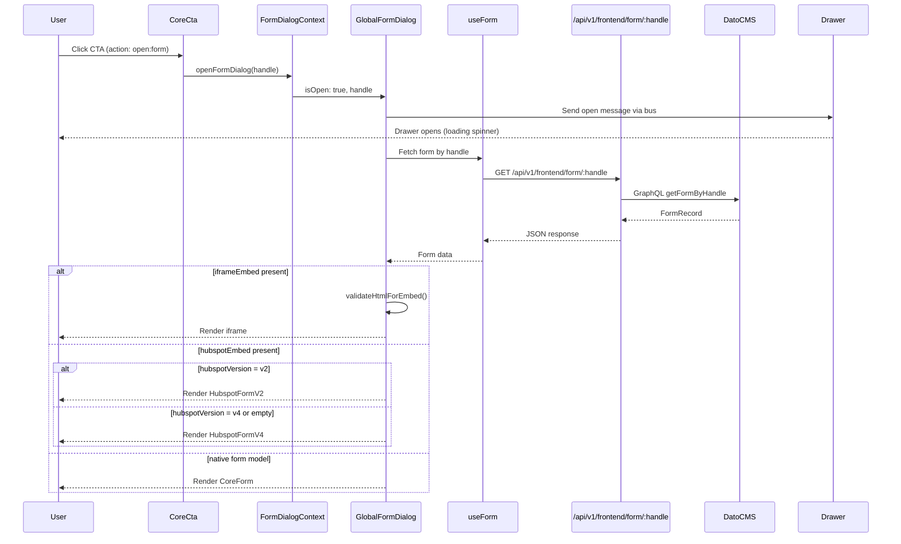
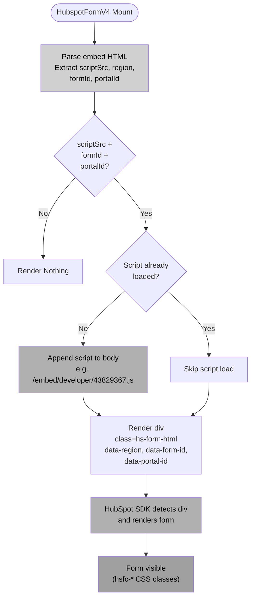
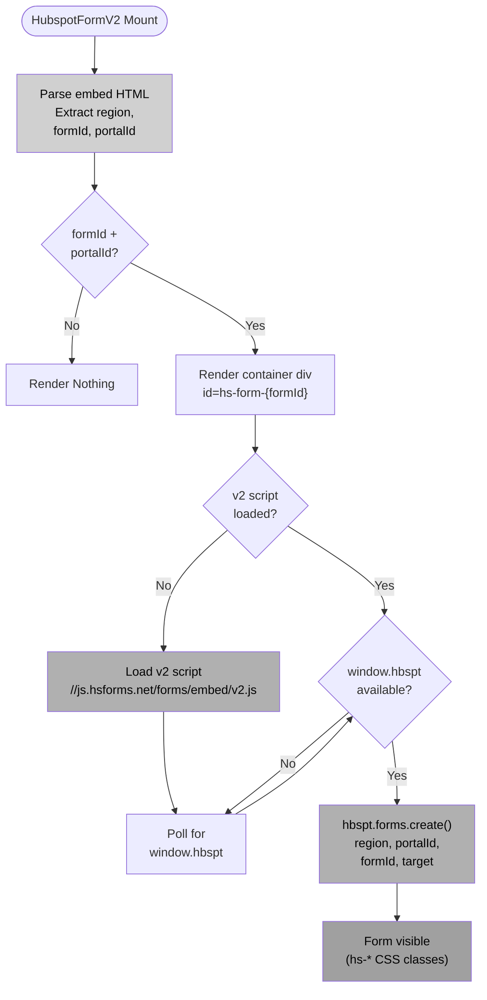

# Forms Feature Flow Diagrams

> **Client-facing overview:** See [Forms — User Journey](./client/readme.md) for a digestible, non-technical summary.

## Form Rendering Decision Tree

[View diagram source](./diagrams/form-rendering-decision.mmd)

## Form Dialog Flow (CTA Trigger)

[View diagram source](./diagrams/form-dialog-flow.mmd)

## HubSpot v4 Rendering Flow

[View diagram source](./diagrams/hubspot-v4-flow.mmd)

## HubSpot v2 Rendering Flow

[View diagram source](./diagrams/hubspot-v2-flow.mmd)

