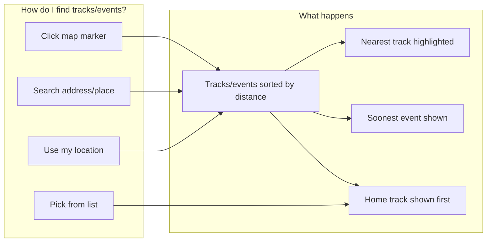

# Track/Event Finder — User Journey

How users find and choose their tracks/events.

## Overview

The trackfinder appears in three surfaces:

1. **Global track finder** (drawer) — Track list with **Nearest**, **Soonest**, and **Home track** badges. Users pick a track and can set it as their home track.
2. **Event finder section** — Event list with search, date range filter, sort, and map. Users find events by location, date, or by clicking map markers.
3. **Booking choose-location** — Same event finder UI used as a step in the booking flow; users select an event to continue.

Users can set their location in four ways:

1. **Use my location** — Let the site use their current location (Find my location / Clear my location button)
2. **Search** — Type an address or place name (zip, city, etc.)
3. **Pick from list** — Choose a track from the drawer and optionally set it as **Home track**
4. **Click map marker** — Click a track marker on the map to use that location for distance sorting

Once a location is set, tracks are shown sorted by distance, with the **Nearest** track highlighted. Each track card shows the **Soonest** upcoming event (next event by date). Users can set a **Home track**, which appears at the top of the list on future visits.

- **Nearest** = closest track by distance.
- **Soonest** = next upcoming event by date.
- **Home track** = the track the user has chosen as their default; it is remembered and shown first.

**What persists:** Only **Use my location** and **Select track** (set as home) update the stored location. **Search** and **map marker click** affect filtering/sorting for the current session only — they do not persist to the location store.

---

## Step-by-step flow

### Option A: Use my location

1. User taps **Find my location** (or selects **Nearest** sort without a location — the site may auto-request it)
2. Browser asks for permission to access location
3. User allows
4. Site shows tracks/events sorted by distance from their current position
5. **Nearest** track is marked (closest by distance)
6. User can tap **Clear my location** to reset

### Option B: Search by address or place

1. User types an address or place name (e.g. "London", "123 Main St", zip code)
2. Site looks up the location (geocoding)
3. Tracks/events are filtered and sorted by distance from that place
4. User sees matching results with the **Nearest** one highlighted
5. **Note:** Search does not persist — it affects the current view only

### Option C: Select a track from the list (drawer)

1. User opens the track finder drawer
2. User browses the track list
3. User taps a track to select it (e.g. "Set as my home track")
4. That track becomes their **Home track**
5. It appears at the top of the list on future visits

### Option D: Click a map marker (event finder section)

1. User views the map with track markers
2. User clicks a marker
3. Events are sorted by distance from that marker’s location
4. **Note:** Map marker click does not persist — it affects the current view only

---

## Sort options (event finder section)

| Sort      | Behavior                                                                 |
|-----------|---------------------------------------------------------------------------|
| **Nearest** | Events sorted by distance. If no location is set, the site may request browser location. |
| **Soonest** | Events sorted by date. Clears search and location — shows global upcoming events. |

---

## Date range filter (event finder section)

Users can filter events by:

- **Start date** — Default: tomorrow. Minimum: tomorrow.
- **End date** — Optional. Events within the range are shown.

---

## What users see

| Step              | User action              | Result                                      |
|-------------------|--------------------------|---------------------------------------------|
| Set location      | Use location / Search / Select track / Map marker | Tracks/events sorted by distance (except Soonest sort) |
| View list         | —                        | **Nearest** track highlighted, **Soonest** event shown, **Home track** first |
| Change track      | Select different track   | New **Home track**, list updates            |
| Clear             | Clear location           | List resets, no distance sorting           |
| Sort Soonest      | Select Soonest           | Search/location cleared, events by date     |

---

## Visual flow (simplified)

---

## Related docs

- [Trackfinder README](../README.md) — Technical overview and hooks
- [Flow Diagrams](../diagrams.md) — Technical flow diagrams for developers
