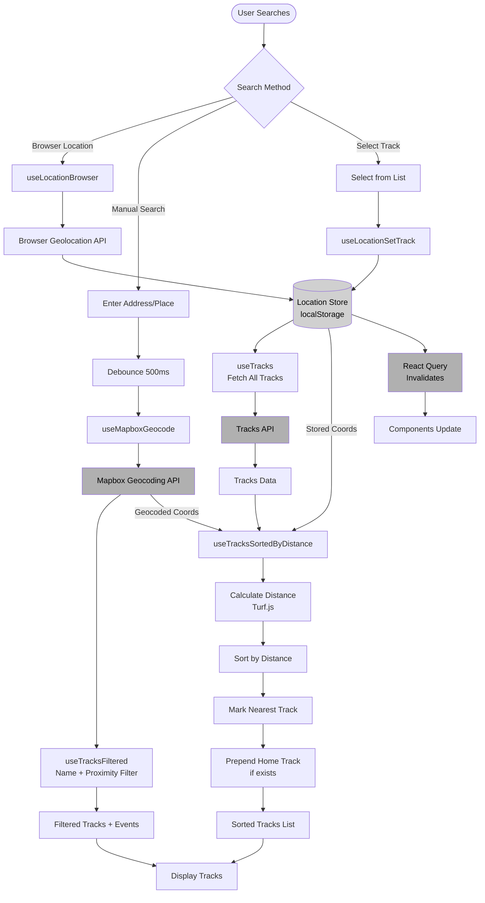
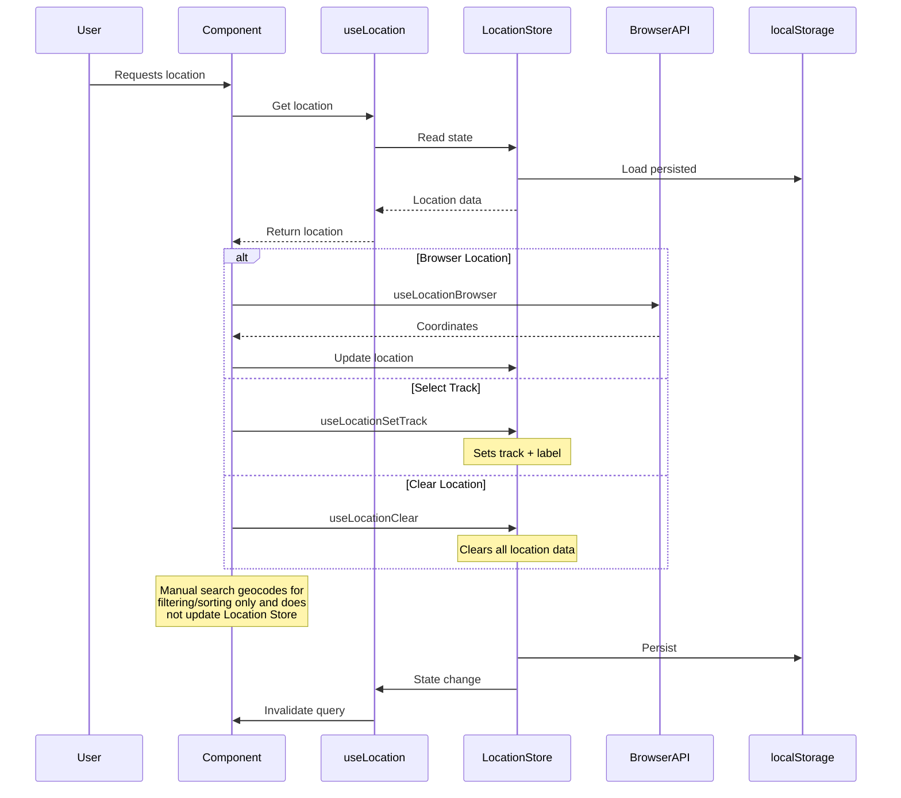
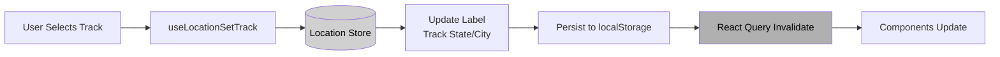
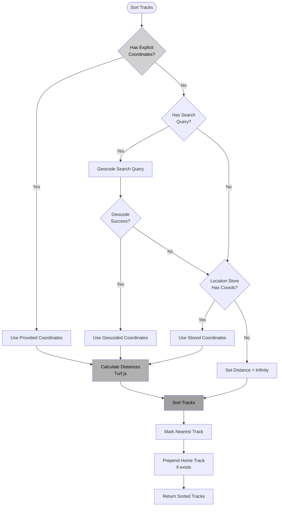
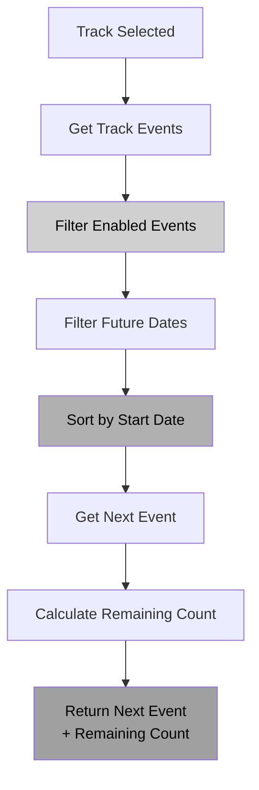

# Trackfinder Feature Flow Diagrams

> **Client-facing overview:** See [Track Finding — User Journey](./client/readme.md) for a digestible, non-technical summary.

## Track Finding Flow

[View diagram source](./diagrams/track-finding-flow.mmd)

## Location State Management

[View diagram source](./diagrams/location-state-management.mmd)

## Track Selection Flow

[View diagram source](./diagrams/track-selection-flow.mmd)

## Track Sorting Flow

[View diagram source](./diagrams/track-sorting-flow.mmd)

## Next Event Calculation

[View diagram source](./diagrams/next-event-calculation.mmd)

